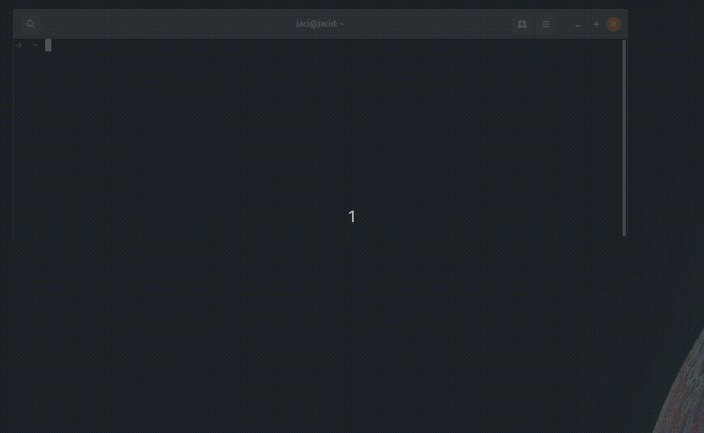

ROS Docker Images
=====

This project provides docker images for ROS, along with optional NVIDIA acceleration support, with a friendly startup script and VSCode development support.

Example use cases:
  - Testing a ROS network in a containerized environment
  - Running ROS melodic on Ubuntu 19.04, or on any unsupported platform



Docker Hub: https://hub.docker.com/r/jaci/ros  
GitHub: https://github.com/JacisNonsense/docker-ros

## Setting Up
1. Install the shell utilities
```bash
cd /tmp
git clone https://github.com/JacisNonsense/docker-ros

cd docker-ros
rm -r ~/.docker-ros
cp -r shell/ ~/.docker-ros
```

2. Edit your `.bashrc` / `.zshrc` to include the following lines
```bash
export UID=${UID}
export GID=${GID}

source ~/.docker-ros/ros.sh

# OPTIONAL: Isolate the default HOME for the docker container if you don't want to passthrough your own.
ROS_DOCKER_HOME=path/to/my/isolated/home
```

3. Install `nvidia-docker2` if you have a NVIDIA GPU: [nvidia-docker repo](https://github.com/NVIDIA/nvidia-docker)

## Running

```
$ ros <version>
```
Where `<version>` is one of the following:
  - `kinetic`, `melodic` - Aliases to `kinetic-desktop-full` and `melodic-desktop-full`
  - `kinetic-ros-core`, `kinetic-ros-base`, `kinetic-robot`, `kinetic-perception`, `kinetic-desktop`, `kinetic-desktop-full`
  - `melodic-ros-core`, `melodic-ros-base`, `melodic-robot`, `melodic-perception`, `melodic-desktop`, `melodic-desktop-full`

For example:
```
$ ros melodic
user@host:/work$ 
```

By default, the `ros` script will automatically:
  - Detect NVIDIA acceleration, and use the `nvidia-docker2` runtime (you must install it first!)
  - Setup X forwarding
  - Create a new container image, passing through your local user and `$HOME`
  - Passthrough your current directory to `/work` via docker bind mount
  - Make the container interactive (`-it --rm`)

You can specify your own image with `--image image`:
```
$ ros --image myname/myimage:version
```

You can launch a program directly from the ros script if you don't require a bash prompt:
```
$ ros melodic rviz
```

## Using with Visual Studio Code (VSCode)
Install the `Remote - Container` extension and copy the `.devcontainer` folder into your VSCode workspace.

Open the command palette with `CTRL + SHIFT + P` and select `Remote-Containers: Reopen Folder in Container`. VSCode will build a new container and open the editor within the context of the container, providing C++ and Python intellisense with the ros installation.

By default, the VSCode containers do _not_ forward X11 nor run on the NVIDIA docker runtime. If you require GUI applications and/or NVIDIA acceleration, launch with `ros <version>` in a terminal (as seen in the 'Running' section above).